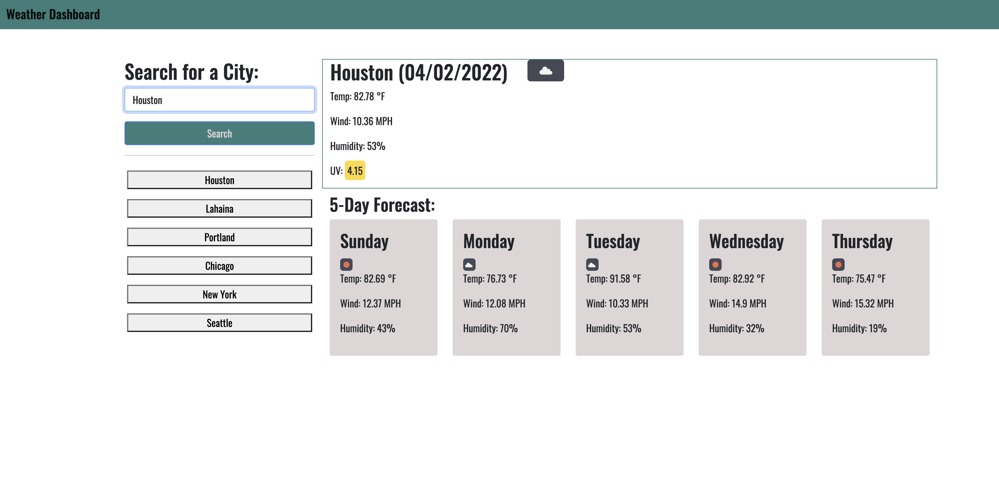

# WEATHER-DASHBOARD

## PROJECT OVERVIEW
This webpage is a weather dashboard that loads the current and forecasted weather data for a location based on a user's city search input. When the user searches a city, the weather info loads incluidng temperature, humidity, wind speed, UV index and an icon depicting overall weather conditions. The UV index includes a background color indicating its severity. The user's searched city populates in the search history below the search bar. These buttons are clickable and will load that location's weather data again.

The webpage is linked [here](https://millersg47.github.io/weather-dashboard/).

## INSTALLATION
Install app locally by cloning the git repo and use a text editor to manipulate the code. 

## CONFIGURATION
The application has no menu or modifiable settings. There is no configuration required.

## USAGE
Use the application to view current and 5-day forecast weather in different locations. 

## CREDITS
No other contributors are involved in the project. 
